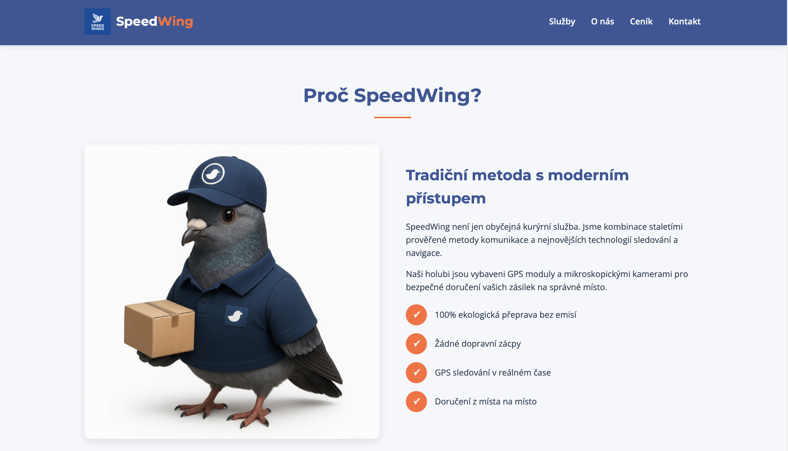
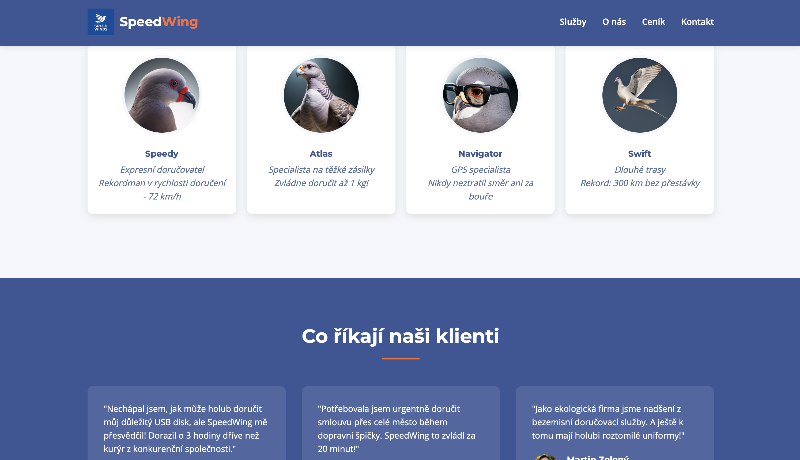

# SpeedWing – Modern Pigeon Post

**SpeedWing** is a fun, fictional website presenting a courier service that delivers packages with the help of trained pigeons. The project is a single-page static site (see `index.html`) that showcases company services, pricing, and coverage, all in a playful, modern style.

## About

This project demonstrates a creative web presentation for a company offering eco-friendly parcel delivery by pigeons. The site is written in pure HTML/CSS and is ready to deploy on GitHub Pages.

- **Homepage:** Presents the brand, services, team, testimonials, and contact info.
- **Coverage Map:** Shows the regions and cities where deliveries or pickups are possible (70 km radius from each main city).
- **Modern look:** Stylish design, responsive layout, and engaging content.
